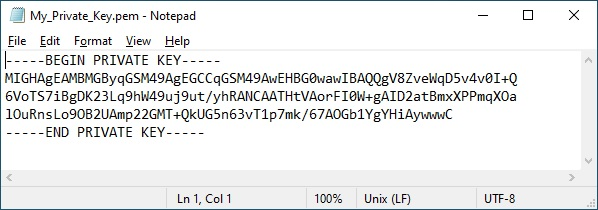
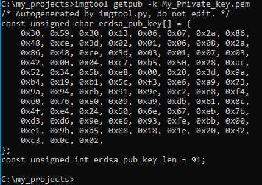
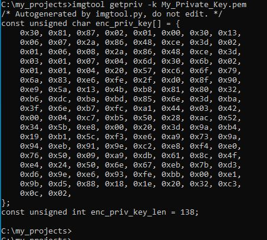

# Creating a private and a public key

First, we will create a PEM file that contiaing just the private-key.

## 1. Generating a PEM file...

There are different ways to creating the PEM file. Here we will use the __imgtool__.

The imgtool can be used to generate rsa-2048, rsa-3072, ecdsa-p256, ed25519, and x25519 keys. Here is the instruction:

    imgtool keygen -k <filename> -t <type> [-p]

|OPTIONS:|  |
|--|--|
| -k < filename > | This file will be generated and it contains the key. (example: -k my-private-key.pem)  |
| -p  | Adding this argument will cause to prompt for a password. You will need to enter this password every time you use the private key. No password is used in case you will not mention this argument. |
| -t < type >     | Key type. It should match what mcuboot is configured to verify. (example: -t rsa-2048) |

| Possible types are: | 
|--| 
| rsa-2048   | 
| rsa-3072   |
| ecdsa-p256 |
| ecdsa-p224 |
| ed25519    |
| x25519     |
 
Example:

Enter following line:

    imgtool keygen -k My_Private_Key.pem -t ecdsa-p256

The file _mytest.pem_ is created and it looks like this:

## 2. Generating the public key

Now we use the generated PEM file and derive the public key. 

    imgtool getpub -k <filename> -l <lang>

|OPTIONS:|  |
|--|--|
| -k < filename > | Enter here the PEM file. |
| -l <lang>       | This parameter defines the format of the ouptut. Default is C language (the default is used when you not enter the -l argument). Valid parameter: "c" (this is the default value) or "rust"    |

Example:
    
The following example does not specify the "-l" parameter. So the default language, which is "C", is selected here.    

    imgtool getpub -k My_Private_Key.pem

Then you get the following output in the command prompt:

    
## 3. Generating the private key
    
The same *.pem file is used to derive the private key. 
    
    imgtool getpriv -k My_Private_Key.pem
    
The following C code is generated:
    

    
This private key is used by MCUboot project. Copy the generated code and replace the appropriate key in the keys.c file (mcuboot project). 
    
