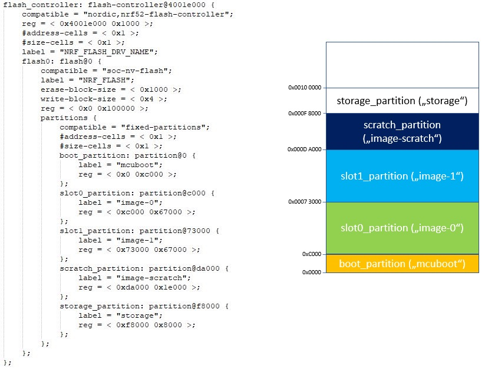
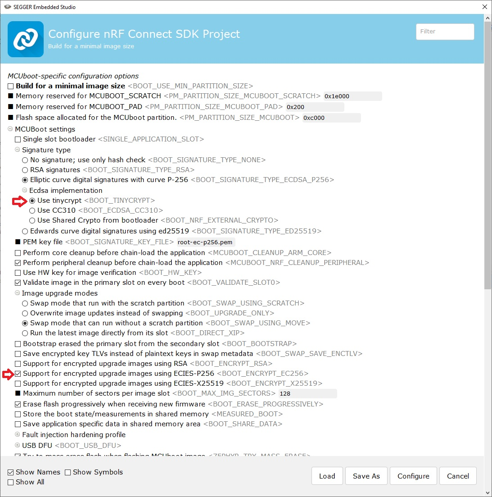
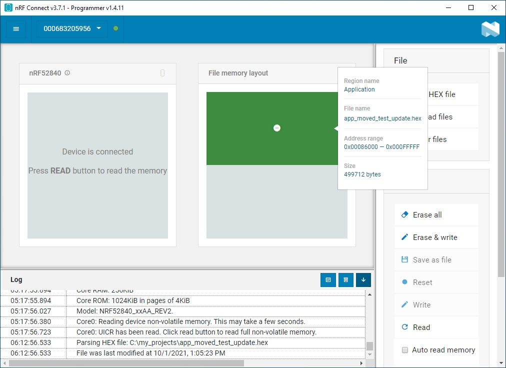

# Application Image Encryption

Signing of an application image is quite simple, because there is support from the toolchain (IDE). Unfortunately the encryption of the application image is not yet supported by the IDEs. This is still a manual task at the moment, that requires to handle the _imgtool_ in the command line. 

Mcuboot is using asymmetric encryption. Asymmetric encrytpion uses two different keys, a private key and a public key. 
We will use the original key file to encrypt the application image, and the mcuboot project is using the derived private key to decrypt the received image.

The mcuboot project uses pre-defined keys. This allows to work with the samples without taking care about needed keys. 
Since these keys are widely distributed, it should never be used for production purpose. It is strongly recommended to use own keys for production purposes!

Asymmetric encryption algorithms are for example:
- RSA [(Rivest-Shamir-Adleman)](https://en.wikipedia.org/wiki/RSA_(cryptosystem))
- ECDSA [(Elliptic Curve Digital Signature Algorithm)](https://en.wikipedia.org/wiki/Elliptic_Curve_Digital_Signature_Algorithm)
- x25519, ed25519 [(Curve25519)](https://en.wikipedia.org/wiki/Curve25519)

Application image encryption is done by following steps:

1. Generate the needed keys
2. Ensure MCUboot uses private key and correct memory partitioning
3. Create an unsigned and unencrytped application image 
4. Encrypt the application image

The following sub-chapters describe these step in detail. 

## 1. Generate the needed keys

[See this page.](CreateKey.md)

## 2. Configure MCUboot

The default keys of the MCUboot project are stored in the NCS folder c:/ < NCS install folder > /v_x_._y_._z_/bootloader/mcuboot as pem files and in the source file __keys.c__ that can be found in the folder c:/ < NCS install folder > /v_x_._y_._z_/bootloader/mcuboot/boot/zephyr

Encrypting the application image requires to change the encryption key in the keys.c file. There are different key types listed. Select the key type you would like to use and replace it with the private key code sequence we have generated in previous step. 

Never reuse the default keys, which are delivered with nRF Connect SDK, for your products. It is only thought for getting easily the samples running! This default key in the mcuboot project is public. The most important security measure to take is to protect your own signing and encryption keys!

Note that the code execution of the application image will happen in the _slot 0_. So the application image has to be placed at the right start address. The start address is defined by the settings that are used for the flash partioning for the mcuboot bootloader. 

Let's take a look on an example. We will use the _blinky_ example. 
Open this project and build. In the build directory you find the zephyr.dts file:

---

c:/myProjects/blinky/build_nrf52840dk-nrf52840/zephyr/zephyr.dts

The device tree file always defines the start address of a partition and its size. In this example the length (size) is defined in a way that there are no gaps between partitions!

---

There are some further MCUboot CONFIG settings required. After adding "CONFIG_BOOTLOADER_MCUBOOT=y" and opening the project you can use the CONIFG tool (e.g. within Segger Embedded Studio) and modifiy the __mcuboot_menuconfig__ settings. I have marked the needed changes in following screen shot:

## 4. Create an unsigned and unencrytped application image     

When you want to encrypt an application image, this has to be done manually using the imgtool command line tool. So generating all the file by setting CONFIG_BOOTLOADER_MCUBOOT=y is not really needed. The advantage using CONFIG_BOOTLOADER_MCUBOOT=y here is that a merged image is created that can be used for the initial programming of the device. The application update image will look different.

Regardless of the CONFIG_BOOTLOADER_MCUBOOT setting, an application image is created in any case. The name of the created file can be defined with CONFIG_KERNEL_BIN_NAME. 
The default name is "zephyr". I assume that the default setting is used and building of the project will generate the unsigned and unencrypted files zephyr.hex (intel hex format) and zephyr.bin (binary format) file. 

## 5. Encrypt Application Image

Maybe you have seen the previous chapter that described the signing of an application image. Unfortunately this cannot yet be used when the image should be encrypted. Signing and encryption has always to be done with the same step. 
          
The _imgtool create_ instructions allows to create a signed or unsigned image. Beside that it also supports encryption of the image. 

The instruction looks like this:

       imgtool sign --pad-header --pad --align 4 -H < headre size > -x < address slot 1 > -S < length of slot 1 > -v a.b.c+d -k < fliename > -E < fliename >  <INFILE> <OUTFILE>
       
       Example:
       imgtool sign --pad-header --pad --align 4 -H 0x200 -x 0x73000 -S 0x67000 -v 1.2.3+4 -k my_signing_key.pem -E my_encryption_key.pem  zephyr.hex zephyr_signed_encrypt.hex
  

| **Parameter**   | **Description** |
|-|-|
| --pad-header    | This parameter triggers to add 0x00 bytes at the beginning of the Intel hex or binary file. This is needed by the tools to allow to place the image header there. The number of "0x00" is determined by the value given in header_size. |
| --pad           | Pad image to --slot-size bytes, adding trailer magic |
| --align x       | alignment of the flash device (1 => 8 bits, 2 => 16 bits, 4 => 32 bits, 8 => 64 bits) |
| -H x            | This parameter defines the header size. Typically the mcuboot header size is 32 bytes. See [this](https://www.mcuboot.com/documentation/design/#image-format) link. However, note that the default setting of this parameter in the MCUboot code is 0x200 (CONFIG_PM_PARTITION_SIZE_MCUBOOT_PAD).  |
| -x x            | Adjust address in hex output file. It is used to place the application update image in slot 1. |
| -S x            | The nRF5x project defines different slots (S0 and S1). Parameter "-S" should define the S1 slot size. |
| -v a.b.c+d      | define a version here. This version allows mcuboot to find out if the sent image is a newer than the one that runs on the nRF5x. 'a' is major number, 'b' is minor number, 'c' is revision, and 'd' is build number. |
| -k < filename > | key filename. This is the key which is used for signing the image. |
| -E < filename > | This parameter triggers the encryption of the image. The file that is given here should contain the key. |
| < INFILE >      | This is the original file. It has to be an Intel Hex file (.hex) or binary file (any other extension).  |
| < OUTFILE >     | The encrypted image will be stored in this file. Use ".hex" extension to store it in Intel Hex format or any other extension to store it as binary file. |

Note:  signing key and encryption key must use the same type of key!

Finding the right address for the -x parameter my be tricky. A simple way to find the right address is to use the __Programmer__ tool (nRF Connect for Desktop) and add the __app_moved_test_update.hex__ file. This file is located in the build/zephyr folder after you have done a successfull build of your project. 

Note: this programmer window shows a different memory partition than the first picute on this page. The first picture was assuming a mcuboot configuration that uses a scratch partition for the swap. The mcuboot configuration for the other screen shot is using "Swap mode that can run without a scratch partition". 
