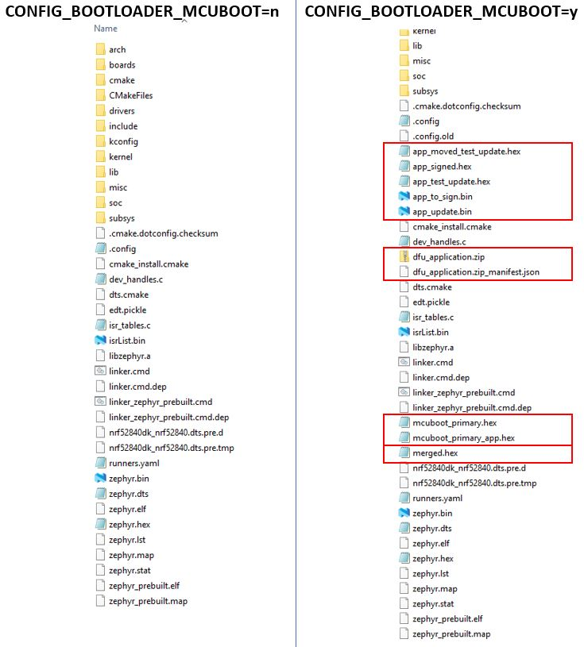

# Create a signed application image

The toolchain is supporting the generation of a signed application image. This is done by setting CONFIG_BOOTLOADER_MCUBOOT=y in your project. Setting this CONFIG causes a multi-image build including the MCUboot project. Moreover the build process generates different intel hex and binary files, that provide different levels of application images (e.g. application image only, signed application image, merged application and mcuboot image, ...). 

---
Here is a list of a few important CONFIGs:

_CONFIG_BOOTLOADER_MCUBOOT_
- This option signifies that the target uses MCUboot as a bootloader. This means, the image is to be chain-loaded by MCUboot. This sets several required build system and Device Tree options in order for the image generated to be bootable using MCUboot. 

_CONFIG_MCUBOOT_IMAGE_VERSION_
- This value is the version number that is passed to the sign app image. It has the format 

      <major> . <minor> . <revision number> + <build number>

_CONFIG_MCUBOOT_SIGNATURE_KEY_FILE_
- You define here which signature key should be used. It should contain an absolute path to the same file as the BOOT_SIGNATURE_KEY_FILE option in your MCUboot bootloader image. 

---

After building the project you find following files in the build/zephyr directory:

- __app_update.bin__: Signed variant of the firmware in binary format (as opposed to intelhex). This file can be uploaded to a server as FOTA image.
- __app_to_sign.bin__: Unsigned variant of the firmware in binary format.
- __app_signed.hex__: Signed variant of the firmware in intelhex format. This HEX file is linked against the same address as the application. Programming this file to the device will overwrite the existing application. It will not trigger a DFU procedure.
- __app_test_update.hex__: Same as app_signed.hex except that it contains metadata that instructs MCUboot to test this firmware upon boot. As app_signed.hex, this HEX file is linked against the same address as the application. Programming this file to the device will overwrite the existing application. It will not trigger a DFU procedure.
- __app_moved_test_update.hex__:  Same as app_test_update.hex except that it is linked against the address used to store the upgrade candidates. When this file is programmed to the device, MCUboot will trigger the DFU procedure upon reboot.
          
          
Example:
- prj.conf file:

      ...
      # Bootloader settings:
      CONFIG_BOOTLAODER_MCUBOOT=y
      CONFIG_MCUBOOT_IMAGE_VERSION=1.2.3+4
      CONFIG_MCUBOOT_SIGNATURE_KEY_FILE="c:/myKeys/myKey.pem"
      ...
   
The following picture shows a comparison of the default blinky project (CONFIG_BOOTLOADER_MCUBOOT=n) and a blinky project with an enabled MCUboot (CONFIG_BOOTLOADER_MCUBOOT=y).

